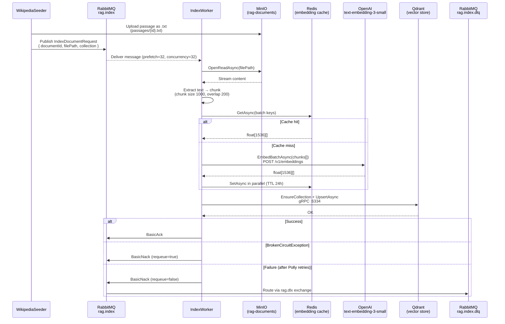
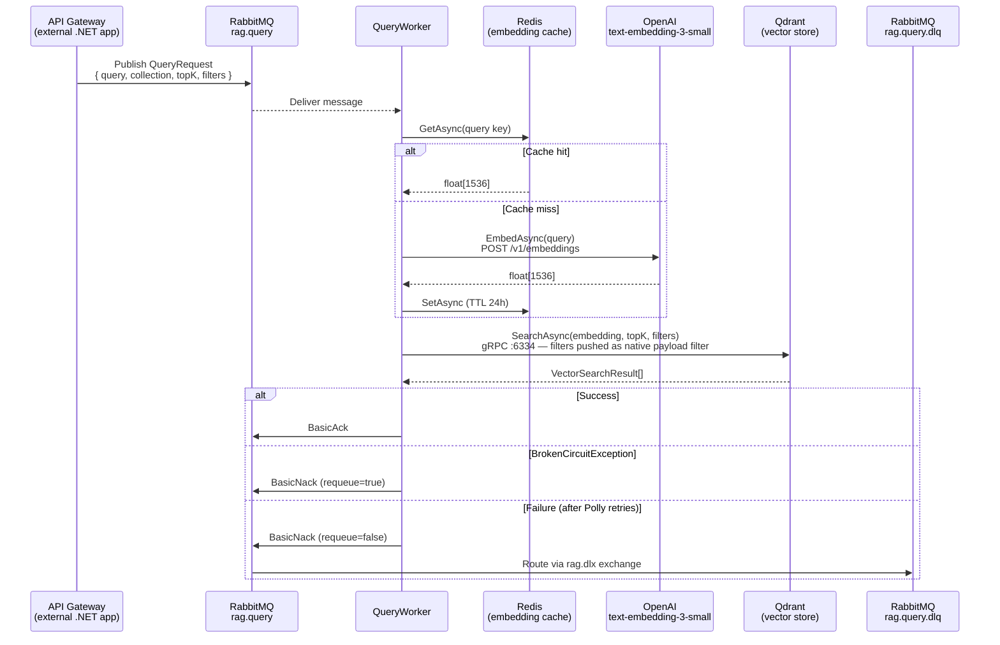
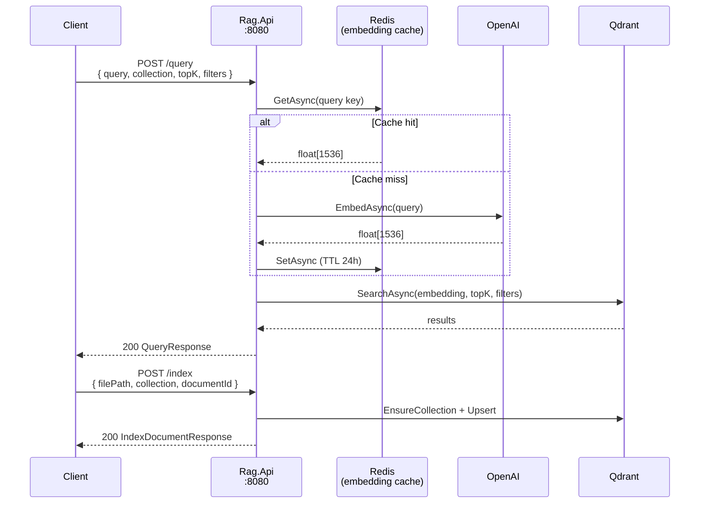

# RagService

A production-ready Retrieval-Augmented Generation (RAG) backend built with .NET 10. Handles document ingestion, vector embedding, and semantic search via a message-driven worker architecture.

## Architecture

### Index Flow



### Query Flow



### Dev/Test Flow (Rag.Api)



## Services

| Service | Description | Port |
|---|---|---|
| `rag.api` | Dev/test REST API (Scalar UI at `/scalar/v1`) | 8080 |
| `rag.indexworker` | Consumes `rag.index` queue, embeds and upserts documents | — |
| `rag.queryworker` | Consumes `rag.query` queue, runs semantic search | — |
| `rag.wikipedia-seeder` | One-shot seeder: downloads HuggingFace dataset → MinIO → RabbitMQ | — |
| `rabbitmq` | Message broker (management UI at `:15672`) | 5672 / 15672 |
| `qdrant` | Vector database (gRPC `:6334`, HTTP `:6333`) | 6333 / 6334 |
| `redis` | Embedding cache (append-only persistence) | 6379 |
| `minio` | S3-compatible object storage (console at `:9001`) | 9000 / 9001 |
| `jaeger` | Distributed tracing UI | 16686 |
| `postgres` | PgVector provider (alternative to Qdrant, not active by default) | 5432 |

## Projects

```
src/
├── Rag.Core/               # Shared library: abstractions, services, providers, resilience
│   ├── Abstractions/       # IBlobStorage, IEmbeddingProvider, IVectorStore, ITextExtractor, IChunker
│   ├── Services/           # IndexDocumentService, VectorSearchService
│   ├── Providers/          # OpenAI, AzureOpenAI, Qdrant, PgVector, MinIO, PDF/DOCX/text extractors
│   ├── Options/            # Typed config: RagOptions, EmbeddingCacheOptions, QdrantOptions, ...
│   ├── Resilience/         # Polly pipelines (ExternalApi, Qdrant, Storage)
│   ├── Telemetry/          # ActivitySource + Meters (rag.documents.indexed, rag.queries.executed, ...)
│   └── Extensions/         # AddRagCore, AddBlobStorage, AddEmbeddingProvider, AddVectorStore
├── Rag.IndexWorker/        # BackgroundService consuming rag.index queue
├── Rag.QueryWorker/        # BackgroundService consuming rag.query queue
├── Rag.Api/                # Minimal API for dev/test
└── Rag.WikipediaSeeder/    # One-shot console app seeding Wikipedia dataset
```

## Resilience

Each external call is wrapped in a dedicated Polly pipeline:

| Pipeline | Targets | Retry | Timeout |
|---|---|---|---|
| `ExternalApi` | OpenAI embeddings | 3× exponential backoff + jitter | 60s |
| `Qdrant` | Vector store operations | 3× exponential backoff + jitter | 30s |
| `Storage` | MinIO get/put | 3× exponential backoff + jitter | 30s |

**Message acknowledgement:**
- **Success** → `BasicAck`
- **BrokenCircuitException** (circuit open, transient infra failure) → `BasicNack(requeue=true)` — message returns to queue and is retried automatically when the circuit closes
- **Other failure** (after all Polly retries exhausted) → `BasicNack(requeue=false)` → routed to Dead Letter Queue via `rag.dlx` exchange

## Observability

| Signal | Implementation | Endpoint |
|---|---|---|
| Structured logs | Serilog → compact JSON | stdout |
| Distributed traces | OpenTelemetry → Jaeger (OTLP gRPC) | `http://localhost:16686` |
| Metrics | OpenTelemetry → Prometheus scrape | `http://localhost:8080/metrics` |
| Health — liveness | Always 200 | `GET /health/live` |
| Health — readiness | Checks Qdrant + MinIO | `GET /health/ready` |

Custom metrics:
- `rag.documents.indexed` — counter, tagged by collection
- `rag.index.errors` — counter, tagged by collection
- `rag.queries.executed` — counter, tagged by collection
- `rag.query.errors` — counter, tagged by collection
- `rag.embedding.duration` — histogram (ms)

## Getting Started

**Start infrastructure + workers:**
```bash
docker compose up -d
```

**Seed the Wikipedia dataset** (downloads ~3200 passages from HuggingFace, uploads to MinIO, publishes to `rag.index` queue):
```bash
docker compose --profile seed run --rm rag.wikipedia-seeder
```

**Query via Scalar UI:**
```
http://localhost:8080/scalar/v1
```

**Sample query:**
```bash
curl -X POST http://localhost:8080/query \
  -H "Content-Type: application/json" \
  -d '{"query": "Who invented the telephone?", "collection": "wikipedia", "topK": 3}'
```

**Sample query with metadata filters:**
```bash
curl -X POST http://localhost:8080/query \
  -H "Content-Type: application/json" \
  -d '{"query": "Who invented the telephone?", "collection": "wikipedia", "topK": 3, "filters": {"language": "en"}}'
```

## Configuration

Key environment variables (see `.env.template`):

```env
RAG__EMBEDDINGPROVIDER=OpenAI          # OpenAI | AzureOpenAI
RAG__VECTORSTOREPROVIDER=Qdrant        # Qdrant | PgVector
RAG__STORAGEPROVIDER=Minio             # Minio | Local
RAG__VECTORSIZE=1536
RAG__DEFAULTTOPK=5

OPENAI__APIKEY=sk-...
OPENTELEMETRY__OTLPENDPOINT=http://jaeger:4317

QDRANT__HOST=qdrant
QDRANT__PORT=6334                      # gRPC port
QDRANT__HTTPPORT=6333                  # HTTP port (used for health checks)

REDIS__CONNECTIONSTRING=redis:6379

EMBEDDINGCACHE__ENABLED=true           # Cache embeddings in Redis
EMBEDDINGCACHE__TTLHOURS=24

RABBITMQ__PREFETCH=32
RABBITMQ__CONCURRENCY=32
```
